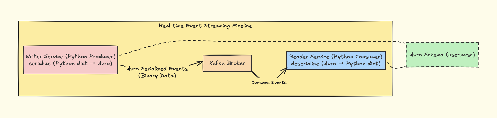

# Streamforge

A simple real-time event streaming system built using **Kafka + Avro + Python**.

This project demonstrates how modern distributed systems communicate using **event-driven architecture** instead of direct service calls.

In traditional systems, services communicate using **REST APIs** with JSON. While JSON is human-readable, it is not efficient for high-throughput systems.

When data is sent over the network, everything is ultimately converted into **bytes**. In the case of JSON, the data is first converted into a string and then encoded into bytes (typically UTF-8). This includes repeated field names and structural characters, which increase the size of each message. Larger message sizes increase the amount of data that needs to be transmitted over the network, which can lead to **higher latency** and slower data transfer.

For example, every message includes keys like "user_id" and "name" again and again, leading to unnecessary overhead.
To address this, this project uses Apache Avro, a binary serialization format. Avro uses a predefined schema and encodes only the values, without repeating field names in every message. Since it is already in binary format, it avoids the extra overhead of text encoding and results in more compact and efficient data transfer.

This makes Avro particularly suitable for systems like **Apache Kafka**, where large volumes of data are continuously transmitted between services.

---

## Architecture



In this architecture, the system is divided into two main services: a **writer service** and a **reader service**, with Kafka acting as the central communication layer between them. The writer service is responsible for generating data in the form of Python dictionaries. Before sending this data, it is serialized using Avro, which converts it into a compact binary format based on a predefined schema. This step ensures that only the actual values are transmitted, without repeatedly sending field names, making the data more efficient for network transfer.

Once serialized, the data is sent to Kafka, which acts as a distributed **message broker**. Kafka stores these events in a topic and makes them available for consumption. One of the key advantages of using Kafka is that it decouples the producer and consumer, meaning the writer service does not need to know anything about who is consuming the data or when.
On the other side, the reader service subscribes to the Kafka topic and continuously listens for incoming events. When it receives data, it uses the same Avro schema to deserialize the binary message back into a Python dictionary, making it usable again in the application.

The Avro schema plays a crucial role in this architecture, as it defines the structure of the data and is shared between both services. This separation of schema and data allows for more efficient serialization and also enables better compatibility in distributed systems.

Overall, this architecture demonstrates how data flows from a producer to a consumer through a streaming platform, enabling scalable, decoupled, and real-time communication between services.

---

## Tech Stack

* Python
* Apache Kafka
* Apache Avro
* Docker

---

## Demo

### Producer Output


### Consumer Output


---

## Project Structure

```
streamforge/
│
├── docker-compose.yml
├── schemas/
│   └── user.avsc
│
├── writer_service/
│   ├── app.py
│   └── producer.py
│
├── reader_service/
│   ├── app.py
│   └── consumer.py
│
├── shared/
│   ├── avro_utils.py
│   └── schema_loader.py
│
├── public/
│   ├── workflow.png
│   ├── producer.png
│   └── consumer.png
│
├── requirements.txt
└── README.md
```

---

## Setup & Run

### 1. Clone the repo

```
git clone https://github.com/your-username/streamforge.git
cd streamforge
```

---

### 2. Setup virtual environment

```
python -m venv .venv
source .venv/bin/activate
pip install -r requirements.txt
```

---

### 3. Start Kafka

```
docker compose up -d
```

---

---

### 4. Test the serialization and deserialization layer

```
python test.py
```

---

### 5. Run Writer Service

```
python -m writer_service.app
```

---

### 6. Run Reader Service

```
python -m reader_service.app
```

---

## Inspiration

Concepts inspired by *Designing Data-Intensive Applications* chapter-4 Avro

---

## If you found this useful, give it a ⭐!
